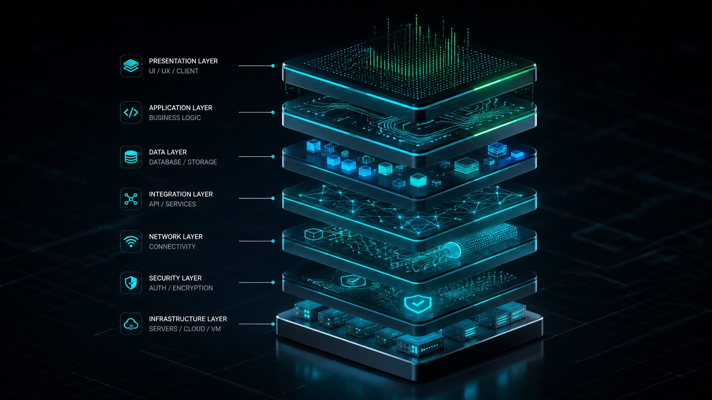
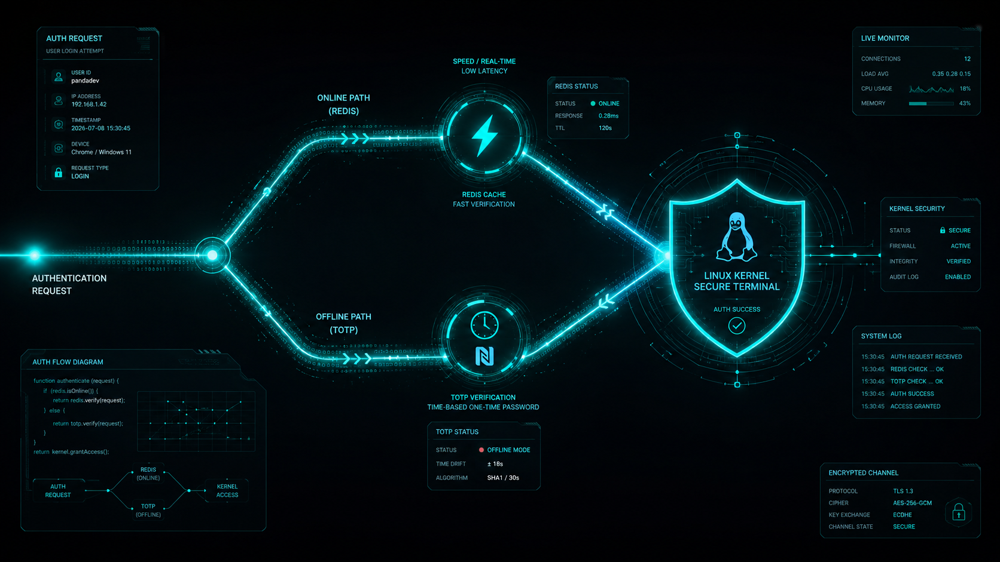

# SCUD Ecosystem: Гібридна інфраструктура контролю доступу корпоративного рівня

**SCUD Ecosystem** — це хмарна високотехнологічна децентралізована екосистема безпеки, розроблена для керування пропускним режимом у сучасних корпоративних мережах. Проєкт поєднує концепцію криптографічного захисту нульової довіри (**Zero Trust Architecture**) та інфраструктурну автоматизацію на рівні ядра операційної системи.

Основна ідея платформи — повна незалежність локальних вузлів проходу та клієнтських додатків від стабільності зовнішнього інтернету, без втрати швидкості обробки запитів та рівня безпеки.

---

## 🌟 Філософія та архітектурна концепція

Традиційні системи СКУД залежать або від централізованого сервера (що створює єдину точку відмови), або від фізичних карток Mifare/EM-Marine, які легко клонуються. **SCUD Ecosystem** вирішує ці проблеми через концепцію **смартфона як універсального інструменту безпеки**:

  

* **Гібридність зв'язку:** Система автоматично перемикається між швидкісним онлайн-режимом (через зашифрований тунель) та повністю автономним офлайн-режимом (якщо прохідна втратила зв'язок із сервером).
* **Ізоляція середовищ:** Логіка віддаленого сервера аутентифікації та локальних застосунків АРМ охорони повністю розділені. Вони взаємодіють через чітко регламентовані інтерфейси без взаємного блокування потоків виконання.
* **Сучасний мінімалізм:** Інтерфейси керування позбавлені "важкого" дизайну. АРМ розроблені в строгому, адаптивному темному стилі, орієнтованому на максимальну швидкість сприйняття критичної інформації (інцидентів, відмов у доступі) в реальному часі.

---

## ✨ Ключові можливості

* 🔒 **Zero Trust Network Access (ZTNA):** Взаємодія мобільних додатків із внутрішньою інфраструктурою відбувається виключно через ізольовані VPN-тунелі WireGuard.
* 📁 **Захищений файловий доступ (NFS):** Завдяки піднятому тунелю, мобільні клієнти отримують прямий доступ до внутрішніх корпоративних NFS-сховищ (документи, інструкції, медіа-дані) без виставлення файлового сервера в публічний інтернет.
* ⚡ **Cross-Pod Orchestration:** Унікальна система управління VPN. FastAPI бекенд динамічно керує віддаленим подом WireGuard через Kubernetes API (`exec`), автоматично реєструючи та видаляючи пірів без перезавантаження контейнерів.
* ⏱️ **Динамічні QR-перепустки:** Генерація одноразових токенів доступу на базі Redis із надкоротким часом життя (TTL 15 секунд) для захисту від перехоплення та копіювання екрана.
* 📱 Безконтактна авторизація (NFC): Заміна класичних карток доступу на надійні NFC-токкени в смартфоні. Система підтримує наскрізне шифрування між мобільним додатком та контролером доступу, що виключає клонування перепусток.
* 📡 **WebSocket Streaming:** Миттєва трансляція подій сканування (надано доступ/відмовлено) на панелі охорони без необхідності polling-запитів.
* 🏢 **Мультилокаційність:** Централізоване управління офісами, складами та КПП з єдиної точки (сумісно з Electron/React дашбордами).

---

## 🧠 Глибокий технічний розбір логіки

### 1. Гібридний двіжок валідації токенів
При взаємодії смартфона з терміналом проходу, ядро безпеки обробляє вхідний токен за комбінованим алгоритмом:

  

* **Онлайн-тракт (Основний):** Якщо пристрій підключено до корпоративного WireGuard-тунелю, додаток генерує криптографічний одноразовий UUID-токен. Бекенд звіряє його через **Redis**. Час транзакції становить **< 1 мс**. Одразу після валідації токен "спалюється" у пам'яті Redis, що унеможливлює атаки повторення (Replay Attacks).
* **Офлайн-тракт (Резервний):** Якщо мережа відсутня, мобільний додаток активує апаратну емуляцію картки (**NFC HCE**) або виводить динамічний QR-код, що містить 6-значний часовий пароль за стандартом **TOTP (RFC 6238)**. Алгоритм використовує унікальний `totp_secret` співробітника та зменшений до 15 секунд тайм-крок. Бекенд автоматично прораховує дрейф годинника у вікні [-1, 0, +1] кроків, гарантуючи прохід навіть при розсинхронізації часу на девайсі.

### 2. Автоматизація тунелювання WireGuard на рівні ОС
Процес активації нового пристрою реалізовано як безшовний інфраструктурний пайплайн:
* Адміністратор генерує тимчасовий токен в АРМ, який зв'язує ID співробітника з сесією активації.
* Мобільний додаток обмінює цей токен на індивідуальні налаштування мережі. На льоту викликаються утиліти генерації ключів `wg genkey` та `wg pubkey`.
* **Принцип незбереження секретів:** Приватний ключ клієнта генерується безпосередньо в оперативній пам'яті під час транзакції, віддається в HTTPS-відповіді клієнту і **ніколи не зберігається в базі даних бекенду**. Сервер оперує лише публічним ключем клієнта.
* Серверний скрипт автоматично взаємодіє з ядром Linux за допомогою команд `wg set wg0 peer...`, динамічно виділяючи ізольовану IP-адресу з підмережі `10.8.0.0/24` та записуючи стан конфігурації за допомогою `wg-quick save`.

### 3. Рольові режими мобільного додатка (Expo / React Native)
Мобільний клієнт адаптує свій інтерфейс залежно від ролі авторизованого користувача, закодованої в JWT:
* **Режим Співробітника (Employee Mode):** Перетворює смартфон на захищену цифрову перепустку. Генерує динамічні QR-коди безпеки та транслює TOTP-пакети через апаратний чіп NFC.
* **Режим Охоронця (Guard Mode):** Активує мобільний сканер пропусків. Використовує камеру пристрою для миттєвого зчитування та розшифровки QR-кодів персоналу на віддалених або мобільних КПП (парковки, виїзні заходи), надсилаючи запити верифікації через захищений тунель безпосередньо на FastAPI.

### 4. Асинхронний стрімінг логів та низькорівневий I/O
Моніторинг пропускних пунктів побудовано на реактивній парадигмі:
* Бекенд використовує асинхронний менеджер зв'язку (**FastAPI WebSockets**). Будь-яка подія з ендпоінту валідації не блокує основний потік транзакцій, а миттєво відправляється фоновою задачею `asyncio.create_task` усім підключеним клієнтам охорони.
* Клієнтський додаток на **PySide6** ізолює мережеву логіку WebSocket від графічного інтерфейсу (UI Thread) за допомогою архітектури `QThread` та механізму сигналів/слотів Qt. Це повністю виключає замерзання або фризи інтерфейсу АРМ при отриманні сотень подій на секунду в години пік.
* Взаємодія з фізичними USB NFC-зчитувачами (на базі чіпів NXP PN532 / ACR122U) реалізована через низькорівневий інтерфейс **PC/SC (pyscard)**, який працює в окремому апаратному потоці, безперервно скануючи шину на предмет появи нових міток.

---

## 🛠️ Інженерний вибір та стек технологій

Екосистема побудована на сучасному та надійному інструментарії, де кожен компонент виконує чітко визначену роль:

  

| Компонент | Технології | Опис |
| :--- | :--- | :--- |
| **Backend Framework** | FastAPI, Python 3.11 | Асинхронний REST API та WebSocket сервер. |
| **Database & ORM** | PostgreSQL, SQLModel | Реляційна база даних з автоматичними міграціями. |
| **In-Memory Cache** | Redis | Зберігання короткострокових QR-токенів та сесій активації. |
| **Network Security** | WireGuard, JWT | Криптографічний VPN-тунель та авторизація за токенами. |
| **File Storage** | NFS (Network File System) | Високошвидкісне мережеве сховище для внутрішніх ресурсів. |
| **Infrastructure** | K3s, Docker, Nginx | Контейнеризація та мікросервісне середовище. |

---

## 🏗 Архітектура безпеки та Активація Пристроїв

Процес додавання нового співробітника до системи СКУД максимально автоматизований та захищений:

1.  **Генерація Коду:** Адміністратор генерує короткий одноразовий код активації (TTL 10 хвилин) у веб-панелі управління.
2.  **Запит Мобільного Клієнта:** Додаток генерує приватний/публічний WireGuard ключ на пристрої та відправляє публічний ключ разом із кодом активації на сервер.
3.  **K8s API Exec:** Бекенд перевіряє токен у Redis, і у разі успіху, через WebSocket з'єднання з K8s API напряму вписує новий пір у мережевий інтерфейс `wg0` віддаленого VPN-поду.
4.  **Створення Тунелю:** Пристрій миттєво отримує конфігурацію і піднімає безпечний тунель до інфраструктури компанії.
5.  **Внутрішній Доступ:** Після встановлення з'єднання додаток може взаємодіяти не лише з API турнікетів, а й монтувати/читати дані з корпоративного NFS-сервера в межах захищеної підмережі (`10.8.0.0/24`).

## 🚀 Розгортання (Kubernetes)

Проєкт постачається з готовими маніфестами для K8s. Він автоматично генерує власні ключі шифрування під час першого запуску (через `initContainers` та спільні PVC).

### Вимоги:
* Робочий кластер Kubernetes (рекомендовано K3s).
* Налаштований Ingress Controller.
* Корпоративний NFS сервер у тій самій або маршрутизованій підмережі.
* Утиліта `kubectl` або налаштований GitOps пайплайн (ArgoCD).

*Примітка: Для доступу ззовні переконайтеся, що UDP-порт 51820 (NodePort) відкритий на вашому маршрутизаторі (наприклад, у конфігурації MikroTik) і прокинутий до кластера.*
---
Developed by [CyberPanda263](https://github.com/CyberPanda263).
